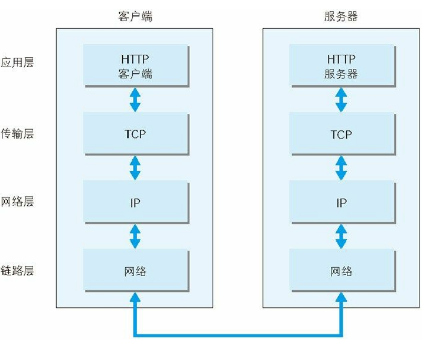

# 了解Web及网络基础

## 1.3.2 TCP/IP 的分层管理

应用层决定了向用户提供应用服务时通信的活动。传输层对上层应用层，提供处于网络连接中的两台计算机之间的数据传输。网络层用来处理在网络上流动的数据包，数据包是网络传输的最小数据单位，该层规定了通过怎样的路径到达对方计算机，并把数据包传送给对方。

## 1.3.3 TCP/IP 通信传输流

首先作为发送端的客户端在应用层发出一个想看某个 Web 页面的 HTTP 请求，在传输层把从应用层处收到的数据（HTTP 请求报文）进行分割，并在各个报文上打上标记序号及端口号后转发给网络层。在网络层，增加作为通信目的地的MAC 地址后转发给链路层。

